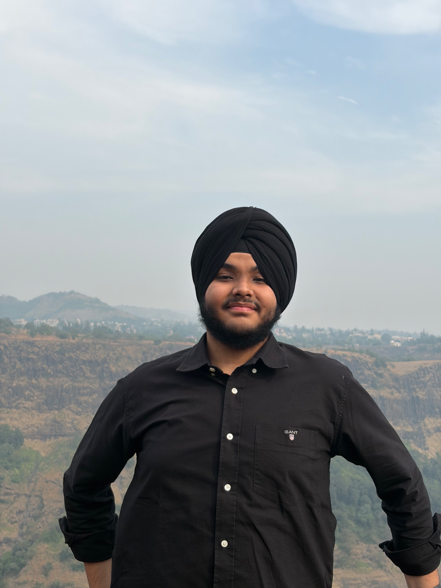

# Tejasvir Singh

## About Me
I am a first-year BBA FinTech student at **NMIMS Mumbai**, having started my degree in **2025**. I have had a keen interest in **mathematics and numbers** from a young age, which naturally developed into an interest in **finance, analytical thinking, and problem-solving**.

I enjoy taking initiative, working in teams, and learning through practical experiences both inside and outside the classroom.

---

## Contact
**Email:** [tejasvir2007@gmail.com](mailto:tejasvir2007@gmail.com)  
**Phone:** [+91 99144 81845](tel:+919914481845)  
**LinkedIn:** [tejasvir-singh-515819366](https://www.linkedin.com/in/tejasvir-singh-515819366)

---

## Education

### NMIMS Mumbai
**BBA FinTech**  
2025 – Present  
**Current Status:** First Year  
**Semester 1 CGPA:** 8.55

### St. John’s High School, Chandigarh
Completed schooling from St. John’s High School, Chandigarh.  
**Class 12 Board Score:** 94.6%  
Awarded a **Merit Certificate** for performance in **Class 11**.

---

## Academic Highlights
- Scored **94.6% in Class 12 boards**
- Achieved **8.55 CGPA in Semester 1**
- Developed a strong interest in **mathematics** from an early age
- Won **Numero Uno** in **Class 2**

---

## Experience and Leadership
- Member of the **school organising committee** for various events, which helped build **management**, **coordination**, and **problem-solving** skills
- Participated in **Model United Nations (MUNs)** and various school competitions
- Part of **SECURITY** for the annual college fest **VAAYU**
- Actively participating in the **Tech Club at ASMOC**

---

## Service and Activities
- Part of **NSS for 2 years**
- Member of the **Photography Club**
- Member of the **Robotics Club**

---

## Achievements
- Successfully reached the goal in a **crowdfunding campaign** in Class 10 held on **Fueladream.com**
- Earned a **Merit Certificate** in Class 11
- Won **Numero Uno** in Class 2
- Strong academic record throughout school and college

---

## Skills
- Microsoft Excel
- Analytical Thinking
- Problem Solving
- Event Coordination
- Teamwork
- Communication
- Management Skills

---

## Core Interests
- Photography
- Gaming
- Cricket
- Formula 1
- Finance and Numbers

---

## Personal Note
In my free time, I like to hang out with friends and listen to music. I enjoy being part of dynamic environments where I can learn, contribute, and grow.